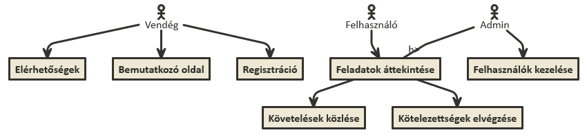

# Iroda project

Ez a repo egy könyvelőiroda és ügyfelei közötti kommunikációt egyszerűsíti, így nem kell telefonon és emailen apróságokat beszélni.

## Felhasználók

3 felhasználó típust különböztetünk meg:
1. Vendég felhasználó: csak az egyszerű bemutatkozás és elérhetőségek oldalakat látja, illetve lehetősége van bejelentkezni.
2. Ügyfél: Feladatokat oszthat ki a könyvelőnek, amikhez határidőt társíthat
3. Admin: a könyvelő felhasználófiókja, feladatokat oszthat ki az ügyfélnek és bregisztrálhatja az új ügyfeleket

## Adatok kezelése

Az adatokat adatbázisban tároljuk. 3 adattábla kiszolgálja az oldalt. Az egyiken a felhasználók adatai lesznek, a másikon a különböző feladatok, amik elévülésük után 2 héttel törlődnek, így nem halmozódik fel fölösleges adat. A harmadik adattáblában a berögzített mindenkire vonatkozó határidőket lehet rögzíteni az adminisztrátornak.

# A feladathoz mellékelt képeket az public könyvtárban mellékeltem.

